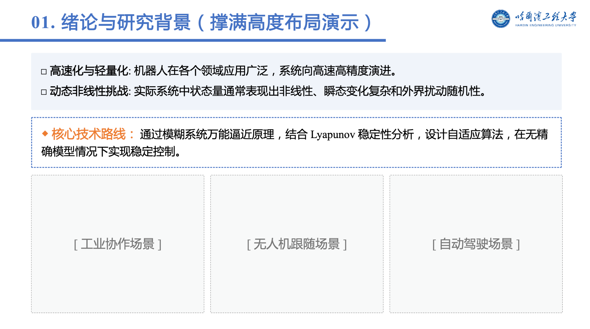
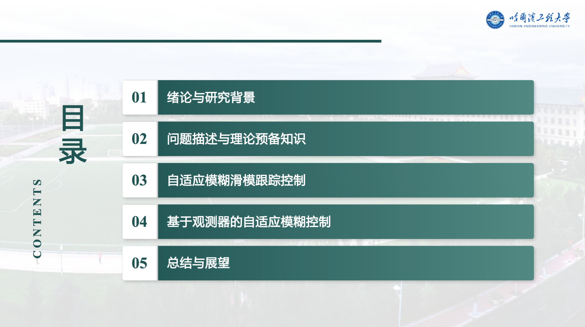

# HEU哈工程风自动化 AI PPT 生成 SKILL


本项目专为打造**哈尔滨工程大学 (HEU)** 专属风格而生，通过结合大语言模型的能力与底层原生 PPTX 模板引擎，为 AI Agent 赋予自动设计、排版与渲染**哈工程风**幻灯片的技能。

最新版采用了**“双阶段解耦（Two-Phase Hybrid）”**工作流：利用了 Markdown/HTML 强大的总结排版打样能力，又结合了 Native PPTX 模板的可编辑性。

---

## 🎯 核心功能与工作流

- **Phase 1: 打样预览 (Markdown -> HTML)**：AI 首回合会根据您的需求，生成 HTML-PPT 页面供您在浏览器中直观预览。
- **Phase 2: 精准提炼注入 (JSON -> PPTX)**：一旦您确认 HTML 打样无误，AI 会自动对内容进行“总结与精简缩减”，将其转化为严格的结构化 JSON，并调用 Python 底层脚本 `build_from_template.py`。
- **Phase 3:  PPTX 模板动态克隆**：脚本支持 `"normal"` (常规) 和 `"highlight"` (虚线强调框) 两种版式，根据 JSON 需求自动调用底层的 `win32com` 无损克隆相应的模板页面，并用 `python-pptx` 注入内容，生成最终的原生可编辑 PPTX。

---

## 📦 前置依赖 (Prerequisites)

为了确保核心脚本能成功运行，您的机器需要具备：
1. **Node.js** (包含 `npx`)：用于在第一阶段将 Markdown 渲染为 HTML。
2. **Python 3**：用于运行核心数据填充脚本。
3. **PPTX 生成引擎（二选一，按平台）**：
   - **Windows + Microsoft PowerPoint**：使用 `scripts/build_from_template.py`，依赖 `win32com.client` 调用本地 PowerPoint 进行无损克隆（仓库默认路径）。
   - **Linux / macOS / 沙箱 / CI**：使用 `scripts/build_pptx_linux.py`，纯 `python-pptx` + `lxml` 实现，无需 PowerPoint，也不需要 `pywin32`。
4. **Python 依赖包**：

   ```bash
   # 通用依赖
   pip install python-pptx lxml
   # PPTX 内原生公式渲染（LaTeX → OMML）
   pip install latex2mathml mathml2omml
   # 仅 Windows 路径需要：
   pip install pywin32
   ```

---

##  :tada: 效果预览





---

## 🤖 给 AI Agent 的配置说明

要让你的 AI 具备这种双阶段工作能力，请遵循以下配置步骤：

1. **设置工作区**：将该仓库的文件设置为 Agent 的工作目录。
2. **注入技能指令**：将本仓库中 `SKILL.md` 文件的内容**完整复制**并粘贴给 Agent 作为 **System Prompt（系统提示词）**。
3. 记得开启 AI 执行本地命令行工具的权限。

---

## 🚀 用户使用教程 (Usage)

当 Agent 配置完毕后，你只需要用自然语言向它下达指令。

**示例对话：**

> **用户**："帮我把这篇项目总结写成 PPT，要带封面和目录。"
>
> **AI (Phase 1 执行)**：
> 1. 读取并生成 Markdown 源码存放在 `output/presentation.md`。
> 2. 自动运行命令：`python scripts/build_html_ppt.py output/presentation.md -o output/presentation.html`。
> 3. 回复用户："HTML 打样已生成，请打开 output/presentation.html 预览。确认无误后请通知我转为 PPTX。"
>
> **用户**："没问题，提炼精简一下，转 PPTX 吧！"
>
> **AI (Phase 2 执行)**：
>
> 1. 总结提取短句，生成 `output/presentation_data.json`。
> 2. 自动运行命令：`python scripts/build_from_template.py output/presentation_data.json templates/template.pptx output/output.pptx`。
> 3. 回复用户：生成完毕，请直接打开 `output/output.pptx`。

---

## 💻 本地手动命令参考 (Commands)

**第一阶段：HTML 生成**
```bash
python scripts/build_html_ppt.py output/presentation.md -o output/presentation.html
```

**第二阶段：PPTX 生成**

```bash
# Windows + PowerPoint
python scripts/build_from_template.py output/presentation_data.json templates/template.pptx output/output.pptx

# Linux / macOS / 沙箱（无 PowerPoint）
python scripts/build_pptx_linux.py    output/presentation_data.json templates/template.pptx output/output.pptx
```

------

## 🤖 协作模型 (Collaborating Model)

本项目由 **Antigravity** (Google DeepMind) 参与协作开发，提供 AI 驱动的代码编写与样式设计支持。
